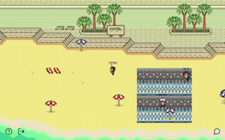
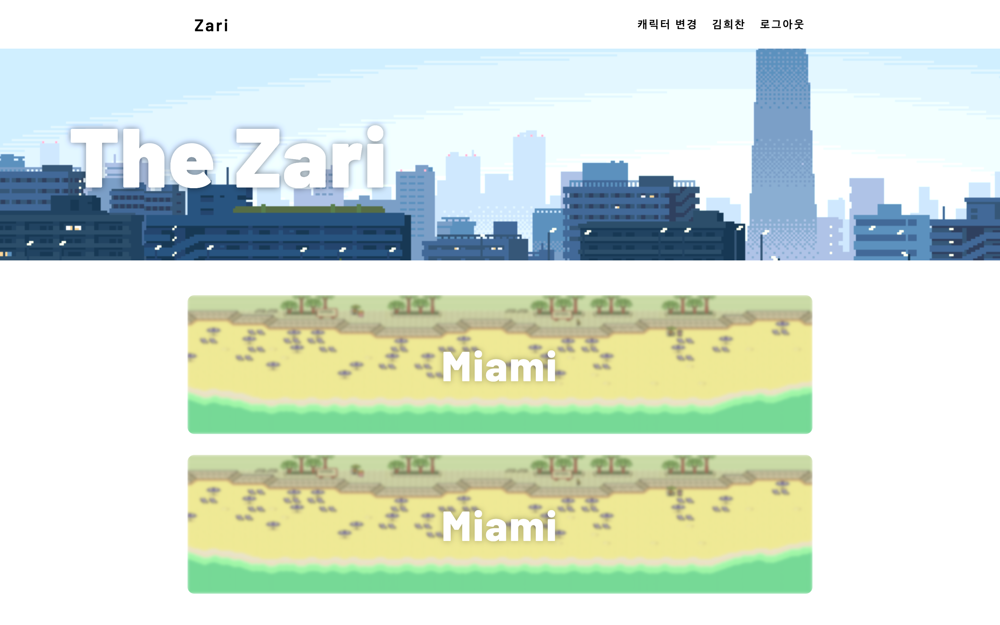
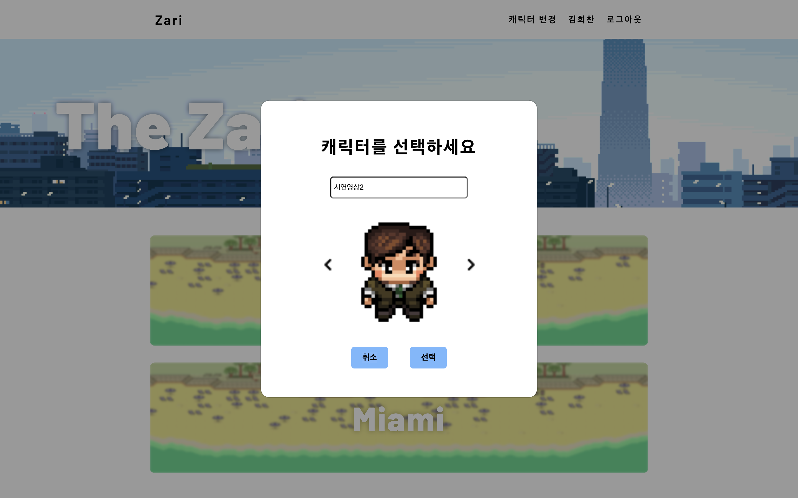
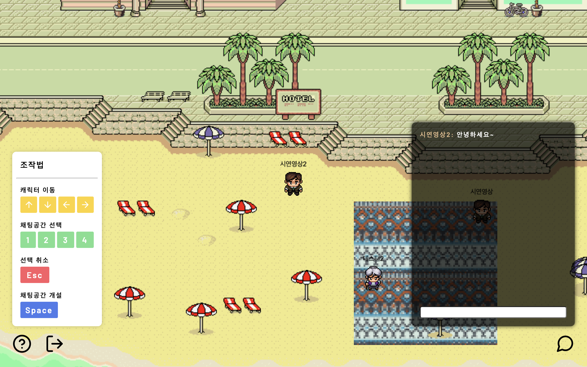
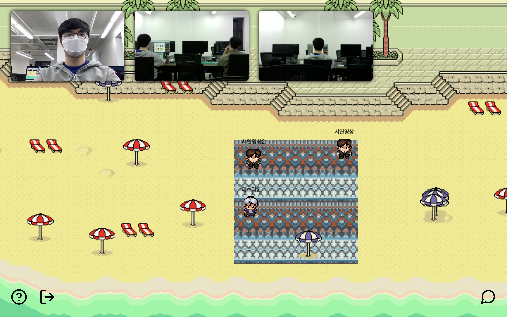
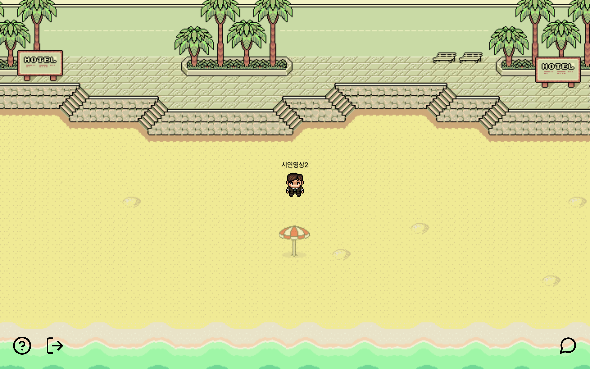
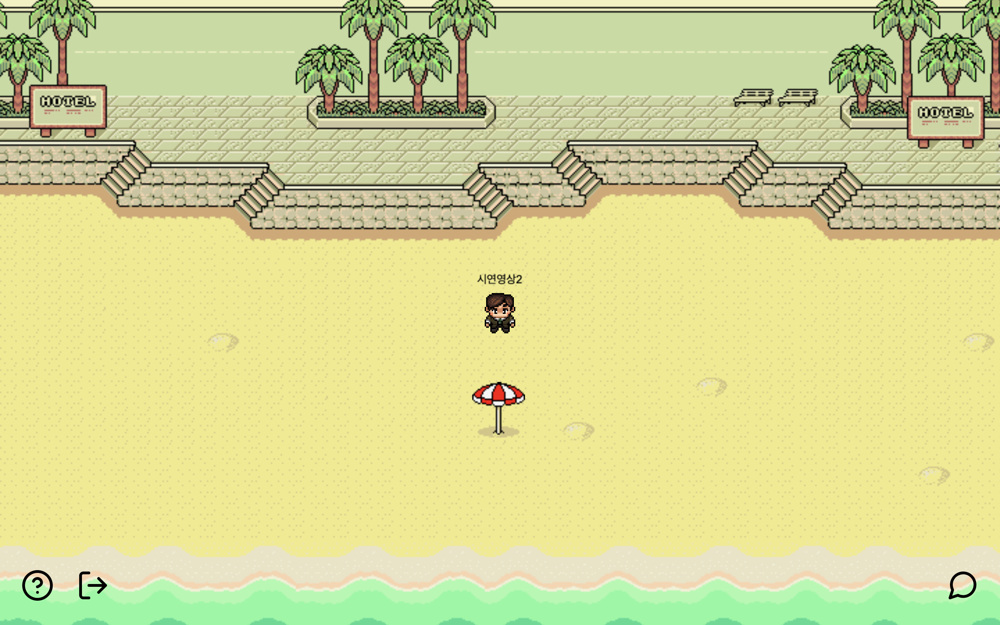

# 🚀 Zari

Zari는 다양한 자리들(돗자리, 술자리 등)을 온라인에서도 경험할 수 있게 해주는 서비스입니다.

## Links

🔗 Front - https://github.com/hee-c/Zari

🔗 Server - https://github.com/hee-c/Zari_server

🔗 배포 링크 - https://zari.today/

🔗 발표 영상 - https://youtu.be/F8OHnevCS30?t=4722

## 테크스택

- Frontend
  - ES2015+
  - React
  - React-router-dom
  - Redux (Redux-toolkit)
  - Redux-Thunk
  - Styled Components
  - [Socket.io](http://Socket.io) Client
  - Simple-peer
  - PIXI.js
  - Firebase
  - Nanoid
- Server
  - Node.js
  - Express
  - MongoDB
  - Mongoose
  - [Socket.io](http://Socket.io)
  - Firebase-Admin
  - JWT (JSON Web Token)

## 프로젝트 동기

코로나19로 인해 모이기가 어려워졌지만 지인들의 모임부터 사무실, 박람회까지 오프라인 만남에 대한 수요는 끊임없이 존재했습니다. 그런 수요와 함께 단순한 화상채팅이 아닌 유저간의 상호작용이 가능한 '메타버스'가 주목받기 시작했습니다.

저는 이 점에서 착안하여 세상에 존재하는 다양한 자리들을 온라인에서도 경험할 수 있는 서비스를 구상하게 되었습니다.

## 작업기간

1주차 (21. 5. 3 ~ 21. 5. 9)

- 아이디어 기획
- UI Mock up 작성
- DB Schema 작성
- Task card 작성
- 초기 폴더 세팅

2주차 (21. 5. 10 ~ 21. 5. 16)

- Canvas, [Socket.io](http://Socket.io), webRTC 구현 및 연결
- WaitingArea page 구현

3주차 (21. 5. 17 ~ 21. 5. 22)

- 유저 기능 추가 (VideoSpace 생성)
- [socket.io](http://socket.io), webRTC 로직 최적화
- 채팅 기능 추가, 가이드 모달 추가
- Room, Home page 구현

## 기능 설명

|                                                              |                                                              |
| ------------------------------------------------------------ | ------------------------------------------------------------ |
| 최초접속후 로그인시 보이는 메인 화면입니다. 접속 가능한 방이 표시됩니다. | 캐릭터 선택창입니다. 캐릭터와 닉네임을 선택하고 방에 입장할 수 있습니다. |
| 방에 접속하면 나오는 화면입니다. 왼쪽에는 조작법 가이드가 있고 오른쪽에는 채팅모달이 있습니다. | 채팅공간 진입시 화면입니다. 좌측에 본인 화면이 나오고, 채팅공간에 들어온 유저들의 화면이 차례로 표시됩니다. 캐릭터가 채팅공간을 나가게 되면 화상연결을 자동으로 끊기게 됩니다. |
| 채팅공간 선택시 선택된 공간이 설치될 자리에 표시됩니다. | 스페이스바 누르면 채팅공간이 생성되고, 다른 유저들에게도 표시되면서 진입시 화상연결이 가능해집니다. |

## 시연 영상

## ⚡️ 기술 이야기

#### PIXI.js를 선택한 이유

WebGL을 통해 2D 그래픽을 렌더링하면서 GPU자원을 함께 쓰기 때문에  기존에 사용하던 canvas나 svg기반 방식에 비해 성능이 월등했습니다. 또한 관련된 라이브러리 중에서는 사용자도 가장 많고, 활성화된 커뮤니티가 존재하고 지속적인 업데이트가 되고 있었기 때문에 선택하게 되었습니다.

canvas를 다루기 위해 PIXI.js를 제외하고도 canvas api와 Phaser3를 고려했지만 canvas api는 WebGL을 사용하는 PIXI.js에 비해서 성능상의 이점이 없고, 작성해야 하는 코드 또한 장황하다는 느낌을 받아서 제외하였습니다.  Phaser3는 게임을 개발하는데 최적화 되어있는 라이브러리기 때문에 추후 확장성이 제한적이라고 생각되었고 해당 라이브러리가 필요할만큼 게임적인 요소가 존재하는 서비스가 아니었기 때문에 제외하게 되었습니다.

## 🔥 어려웠던 점

🏗 webRTC 구조 문제

일반적으로 사용되는 webRTC 구조는 모두가 1:1 connection을 갖는 Mesh방식인데 이 방식은 참가자 수에 비례해서 uplinkd와 downlink 가 하나씩 늘어나기 때문에 네트워크 대역폭 문제가 발생하고 클라이언트가 참가자 수 만큼의 video encoder를 필요로 하기 때문에 CPU에도 많은 부하가 걸리게 됩니다. 따라서 PC마다 차이는 있지만 4 ~ 5명 이상의 참가자가 존재하면 연결이 불안정하거나 끊기게 됩니다.

이번 프로젝트는 여러명이 참여하는 화상채팅이 필요했기 때문에 클라이언트의 부하를 줄일 수 있는 방법을 찾아보게 되었고 해답으로 나온 구조가 Selective Forwarding Unit, SFU 구조입니다. SFU 구조는 서버에서 upload된 video를 routing 해주기 때문에 참가자 수가 몇명이든지 uplink는 한개밖에 존재하지 않고 CPU에 부하를 일으키는 encoder도 한개만 존재하게 되면서 클라이언트 PC에 부하가 현저하게 덜 걸리게 됩니다.

하지만 며칠에 걸쳐 SFU 라이브러리인 mediasoup의 구현을 시도했지만 정상적으로 동작하지 않아 결국 simple-peer를 사용한 Mesh 구조로 변경하여 구현하였습니다. 프로젝트에 알맞는 구조가 무엇인지 알았지만 시간의 제약으로 인해 활용하지 못한 점이 아쉽습니다. 프로젝트 종료 후 리팩토링을 통해 SFU 구조로 연결 방식을 변경할 예정입니다.

👀 사라지지 않는 리스너

단일 문제로는 디버깅에 가장 긴 시간이 걸린 오류였습니다. 캐릭터의 움직임에 따라 리액트 컴포넌트가 동적으로 생성되었다 사라지는데 이 과정에서 socket의 event listener를 unmount시에 적절하게 제거해 주지 않아서 발생한 문제였습니다. 로직상으로는 아무런 문제가 없어 보이는데 특정 동작을 하면 오류가 발생해서 오류 원인을 찾는데 오랜 시간이 걸렸습니다. 오류 원인을 찾고서는 허무할 정도로 빠르게 해결했지만 결국 원인은 socket 관련 로직이 여러곳에 흩어져 있고 그것이 react의 life cycle과 엮이면서 발생한 문제라고 판단했습니다. 따라서 socket 관련 로직을 디버깅 및 유지보수가 용이하도록 한곳으로 모으는 방향으로 수정했습니다.
